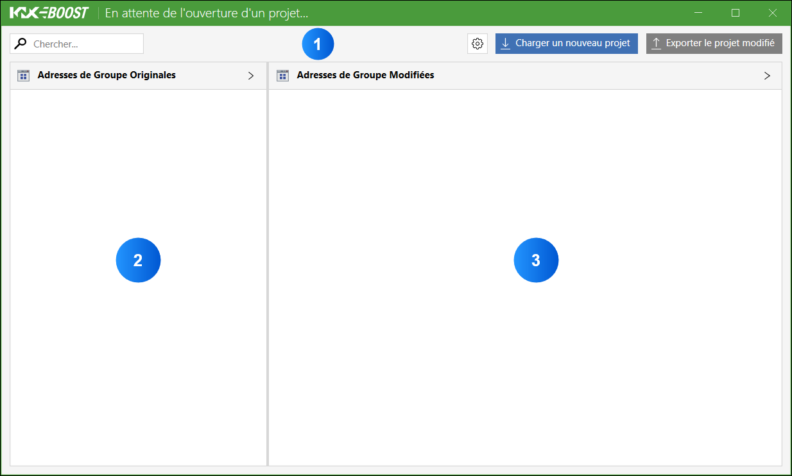

## 2. 🔍 Application Overview

### 2.1 🪟 Main Window

The main window consists of three main parts:

  

**1. The top bar:**

In this bar, you can 📥 [Import a Project into KNX Boost Desktop](../UtilisationApplication/import-a-project-in-knx-boost-desktop.md) by clicking on the "**Load a New Project**" button.
Similarly, once the address modifications have been made, you can 📤 [Export Modified Group Addresses](../UtilisationApplication/EN-export-modified-group-addresses.md) using the "**Export Modified Project**" button. The button with the gear icon opens the settings menu. Finally, the search bar allows for specific searches within Panels 2 and 3.

**2. Original Addresses Panel:**

In this panel, after importing your project, the group addresses as they are named in the current project will appear.

**3. Corrected Addresses Panel:**

Similarly, in this panel, the corrected group addresses will appear. See section    3.3. 🚶‍♂️‍➡️ [Navigate the Modified Project](UtilisationApplication/EN-navigate-the-modified-project.md)
 for more details on these views.

[← Back](../README-EN.md)
