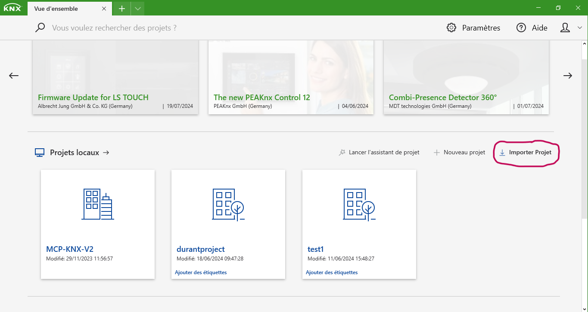
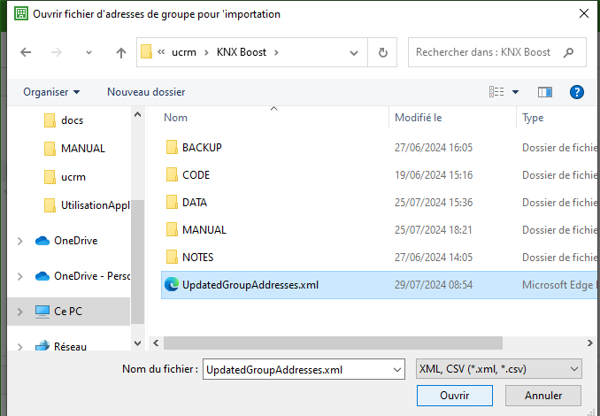

## Importer le projet modifié dans ETS 6  
Open the project before changes in ETS. In the Group Adresses Window, right click on Group Adress, then choose import group address.  
   
Select the file UpdatedGroupAddresses.xml.  
  
Note : ETS use a signature system. You cannot import a .knxproj that have been modified outside ETS.  
[← Retour](utilisation.md)