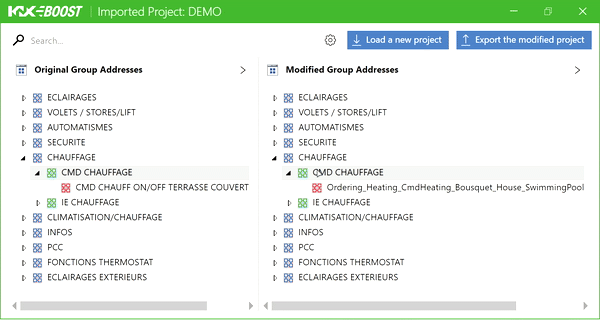
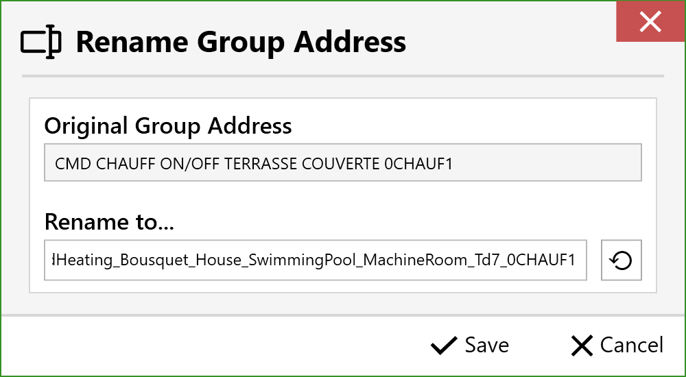

## 3. 🛠 Using the Application
### 3.4. 📝 Manually Rename Group Addresses
#### 3.4.1 Access the Window
To manually modify a group address changed by the software, **double-click** on the relevant address in the table on the right, the table of modified group addresses.

The address renaming window will open. You will see the original address provided to the software; you can select and copy elements to keep.
The lower field corresponds to the modifiable address. Remove and add elements as needed while maintaining consistency in the address structure.

#### 3.4.2 Reset
To cancel the changes made, click the reset button to the right of the modification field. Resetting restores the address generated by the software.

#### 3.4.3 Save and Cancel
When you are satisfied with the changes, click the "Save" button to apply the changes in the main window tables. Otherwise, click the cancel button to undo all changes.

[← Back](../README-EN.md)
