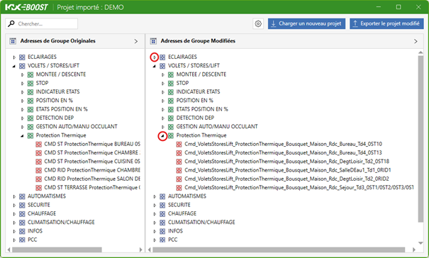
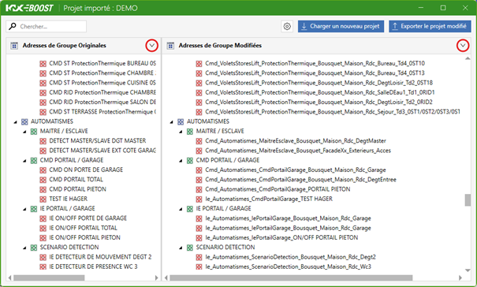
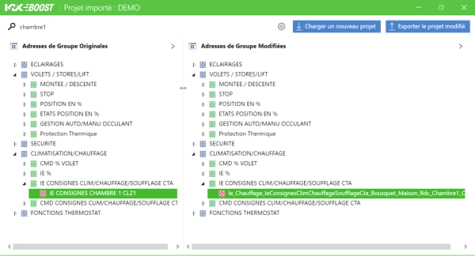
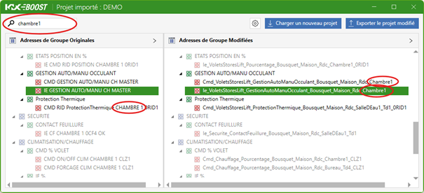

## 3. 🛠 Using the Application
### 3.3. 🚶‍♂️‍➡️Navigate the Modified Project

Once your project is loaded, you will access the 🪟 [Main Window](ApplicationOverview/mainwindow.md) with the group addresses collapsed by default.

#### 3.3.1 Show/Hide Elements
*Note: The display is synchronized across both tables.*

To reveal the sub-elements of a group, click on the hollow triangle (▷) to the left of the main group element.
To hide the sub-elements, click on the solid triangle (◢) corresponding to it.

To manage the display of *all elements*, use the toggle in the top right corner of each table.

#### 3.3.2 Vertical and Horizontal Navigation
Scroll vertically in sync across the group address tables using the vertical scroll bar to the right of the tables or by using your mouse wheel.

Scroll horizontally in each table using the horizontal scroll bars at the bottom of each table or by holding down the SHIFT key while using the wheel.

#### 3.3.3 Managing Table Width
Click and drag the vertical separator between the two tables to customize the width of each according to your needs.

#### 3.3.4 Search
Use the field at the top left of the window to perform a simultaneous search across both tables. All rows matching the search will remain displayed, as well as the corresponding row in the other table.

#### 3.3.5 Load a New Project
Loading a new project will remove the changes made to the current project. Please 📤 [Export the modified group addresses](UtilisationApplication/EN-export-modified-group-addresses.md) from the current project before proceeding.

To follow the import procedure, see the section "📥 [Import a Project into KNX Boost Desktop](UtilisationApplication/import-a-project-in-knx-boost-desktop.md)".

#### 3.3.6 Modify Renaming Settings
If you want to modify and re-run the renaming of group addresses, refer to the section "⚙️ [Settings Menu](ApplicationOverview/settingswindow.md)".

[← Back](../README-EN.md)
