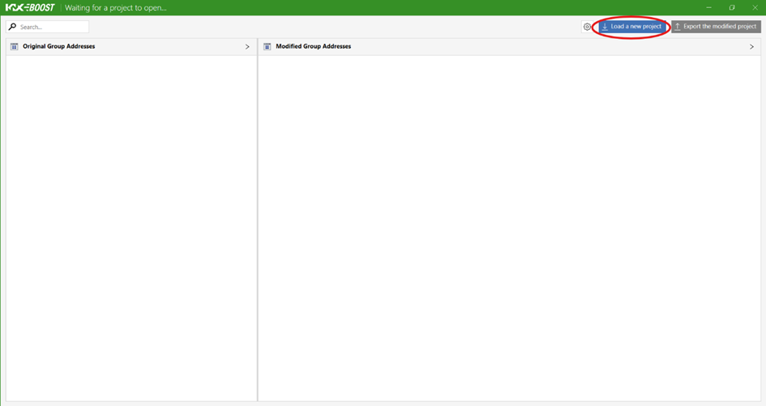
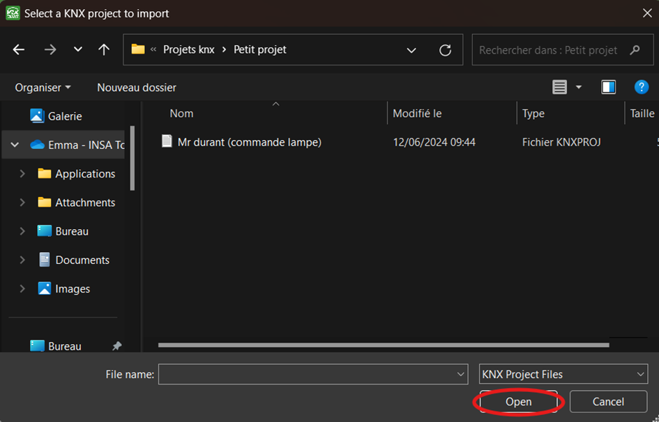
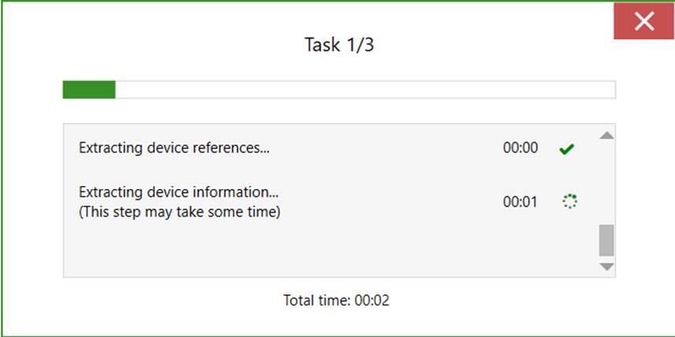

## 3.2. 📥 Import a Project into KNX Boost Desktop

### 1. Launch the Application

- Open the KNX Boost Desktop application. 
   
   
### 2. Load a New Project

- Click on the Load a new project button located at the top right of the screen.

 
 
 
### 3. Select the ETS Project

- A window will open, allowing you to browse your folders.

- Navigate to the folder containing the ETS project you want to import.

- Select the project file and click Open to start the import.

 
 
 
### 4. Loading Window

- Once the project is selected, a loading window will appear to indicate the ongoing import process.

[← Go back](../README-EN.md)
