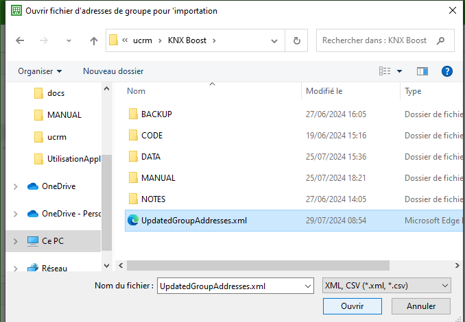

## 🛠 Utilisation de l’application
### 🟩 Importer les adresses de groupe modifiées dans ETS 6
Ouvrir ETS et cliquer sur importer.

Sélectionner le projet (le .xml, pas le .knxproj !) et cliquer sur ouvrir.

[← Retour](utilisation.md)
