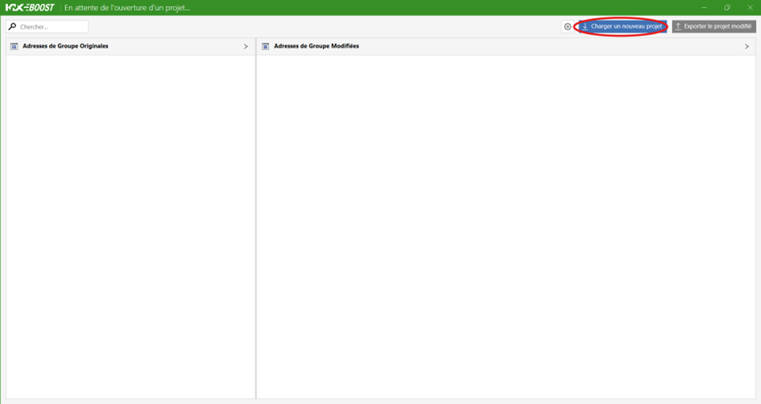
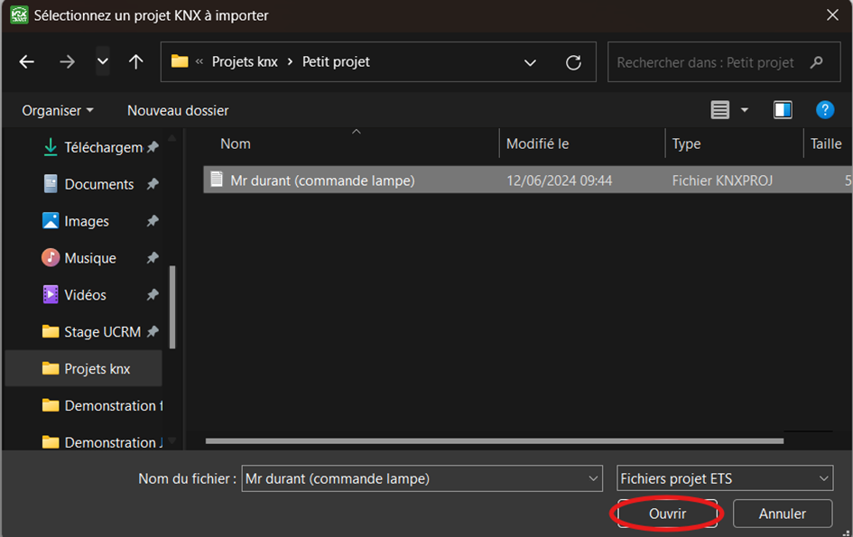
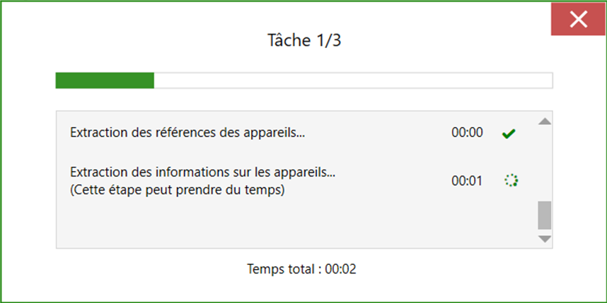

## 3.2. 📥 Importer un projet dans KNX Boost Desktop

### 1. Lancer l'Application

- Ouvrez l'application KNX Boost Desktop.

### 2. Charger un Nouveau Projet

- Cliquez sur le bouton Charger un nouveau projet situé en haut à droite de l'écran.

### 3. Sélectionner le Projet ETS

- Une fenêtre s'ouvrira, vous permettant de parcourir vos dossiers.

- Naviguez jusqu'au dossier contenant le projet ETS que vous souhaitez importer.

- Sélectionnez le fichier du projet et cliquez sur Ouvrir pour lancer l'importation.

### 4. Fenêtre de Chargement

- Une fois le projet sélectionné, une fenêtre de chargement apparaîtra pour indiquer le processus d'importation en cours.

[← Retour](../README.md)