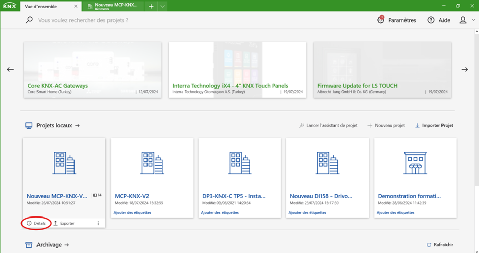
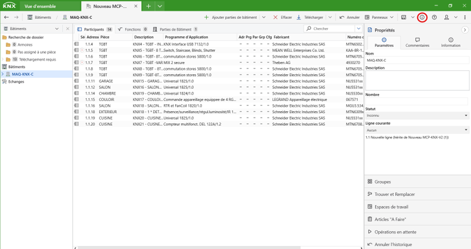
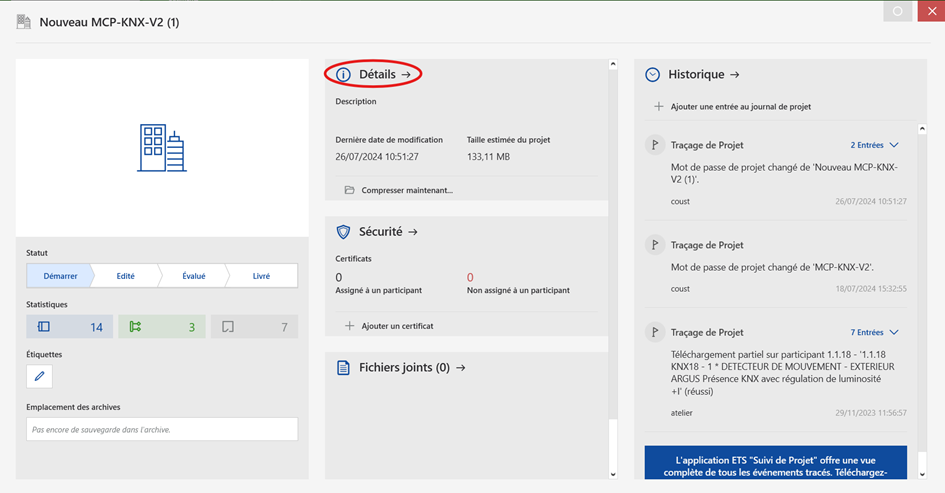
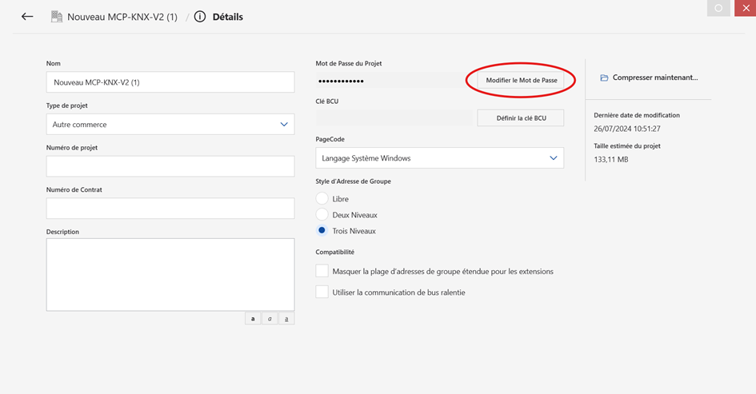
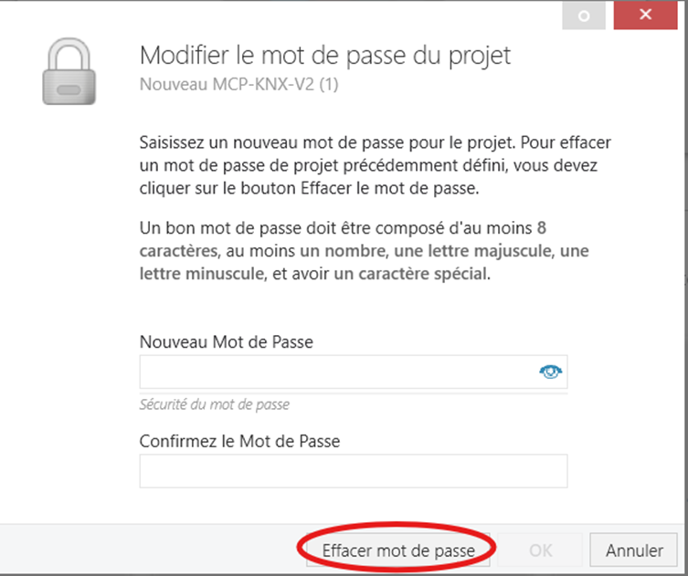
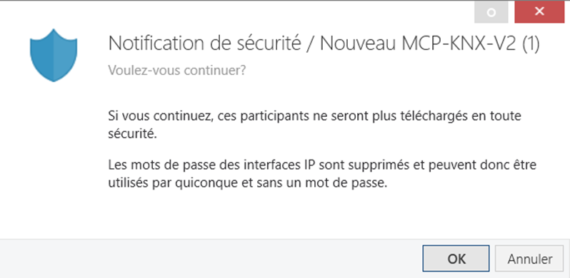
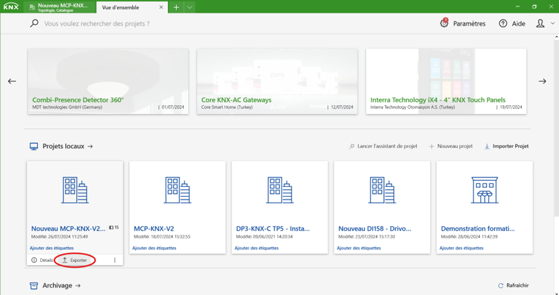
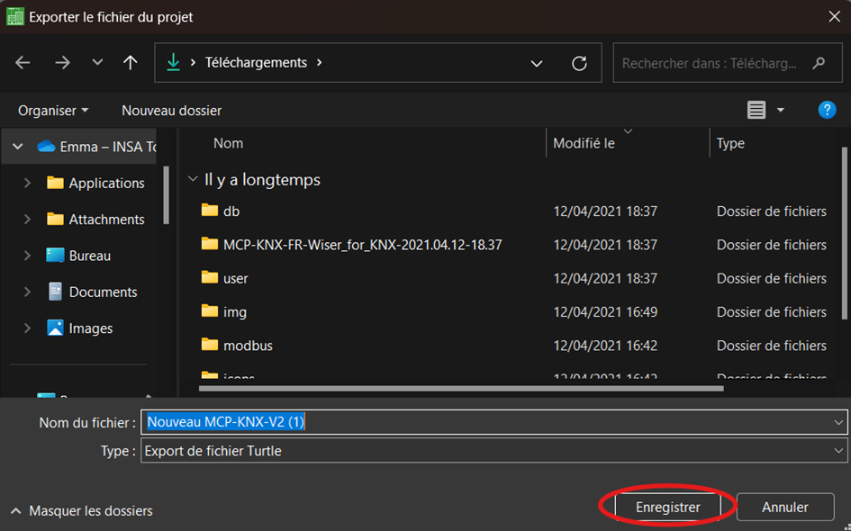

## 🛠 Utilisation de l’application
### 3.1. 📁️ Récupérer le projet dans ETS 6

Pour que KNX Boost Desktop puisse fonctionner correctement avec un projet importé, il est essentiel que ce dernier ne soit pas protégé par un mot de passe. Si votre projet est protégé par un mot de passe, suivez ces étapes pour le retirer : 
 
 
### Suppression du Mot de Passe

1.	**Accéder aux Détails du Projet**

- 	Sur la page d’accueil, survolez le projet concerné. Les boutons **Détails** et **Exporter** apparaîtront. Cliquez sur le bouton **Détails**.

- 	Si le projet est déjà ouvert, cliquez sur le bouton i en haut à droite de la fenêtre.

2. **Modifier le mot de Passe**

- Une fois la fenêtre ouverte, cliquez sur le bouton **Détails** situé en haut et au centre de la fenêtre.

- Cliquez ensuite sur **Modifier le Mot de Passe**.

- Enfin, cliquez sur **Effacer mot de passe** pour retirer la protection par mot de passe.

3.	Gestion des Participants KNX Secure
    
- Si vous utilisez un ou plusieurs participants KNX Secure, une notification apparaîtra indiquant que la sécurité des participants sera désactivée. Vous pourrez réactiver la sécurité une fois le projet exporté.

 
 
 
### Exportation du Projet

1.	**Revenir à la Vue d’Ensemble**

- 	Retournez à la fenêtre de vue d’ensemble.

- 	Survolez le projet que vous souhaitez exporter. Les boutons **Détails** et **Exporter** apparaîtront. Cliquez sur le bouton **Exporter**.

2.	Enregistrer le Projet

- 	Choisissez le dossier de destination et le nom du fichier.

- 	Cliquez sur **Enregistrer** pour finaliser l’exportation du projet.

[← Retour](../README.md)
