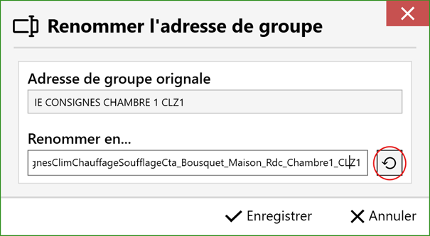

## 3. 🛠 Utilisation de l’application
### 3.4. 📝 Renommer les adresses de groupes modifiées
#### 3.4.1 Acceder à la fenetre
Pour modifier manuellement une adresse de groupe modifiée par le logiciel, **double-cliquez** sur l’adresse concernée dans le tableau à droite, celui des adresses de groupe modifiées.

La fenêtre de renommage de l’adresse s’ouvre. Vous y verrez l’adresse originale fournie au logiciel, vous pouvez y sélectionner et copier des éléments à conserver. Le champ du bas correspond à l’adresse modifiable. Retirez et ajoutez les éléments que vous souhaitez tout en maintenant une cohérence dans la structure des adresses.
 
  

#### 3.4.2 Réinitialiser
Pour annuler les modifications effectuées, cliquez sur le bouton de réinitialisation à droite du champ de modification. La réinitialisation rétablit l’adresse générée par le logiciel.

  

#### 3.4.3 Sauvegarde et annulation
Quand vous êtes satisfait des modifications, cliquez sur le bouton « Enregistrer » pour appliquer les modifications dans les tableaux de la fenêtre principale. Sinon, cliquez sur le bouton d’annulation pour annuler toutes les modifications.

[← Retour](../README-EN.md)
