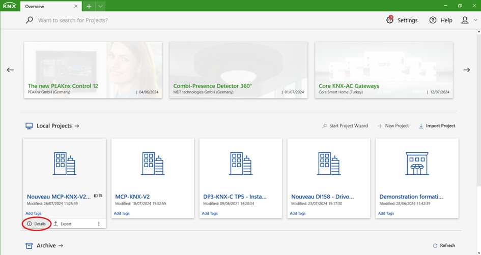
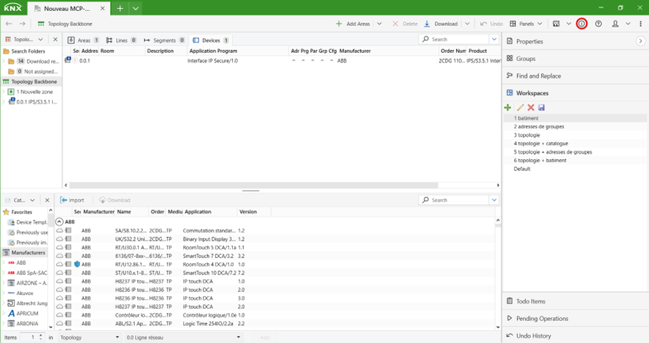
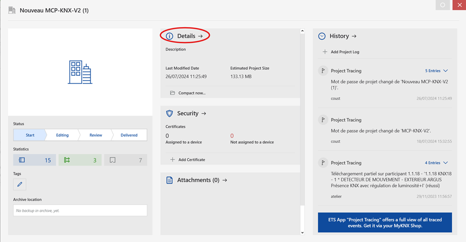
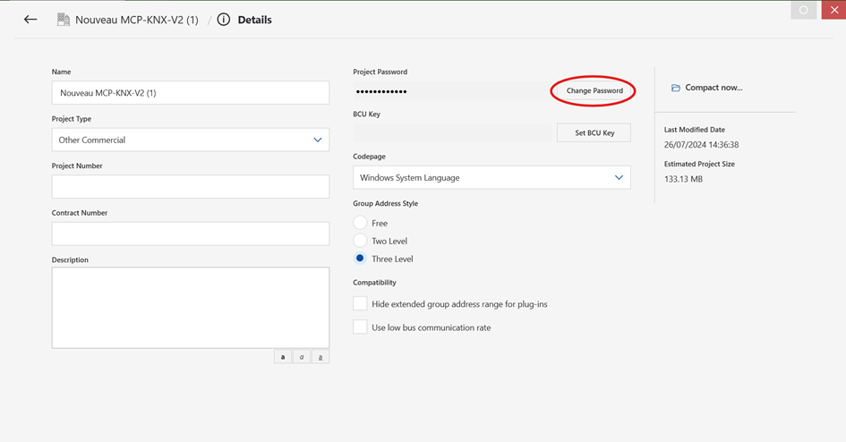
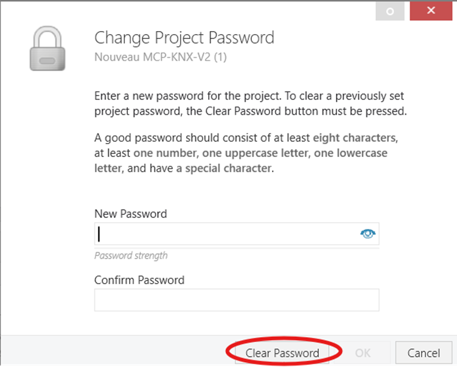
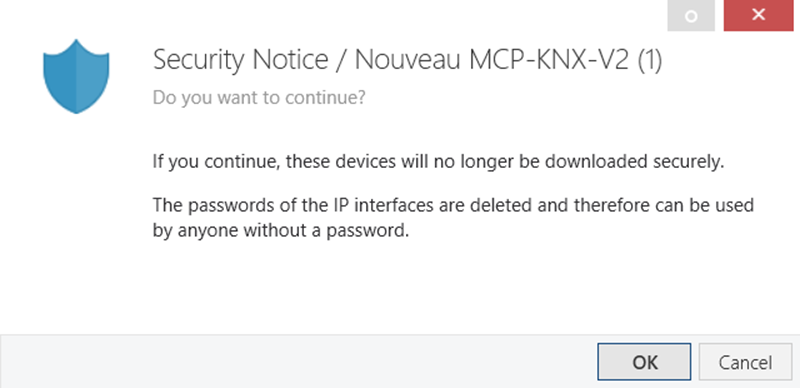
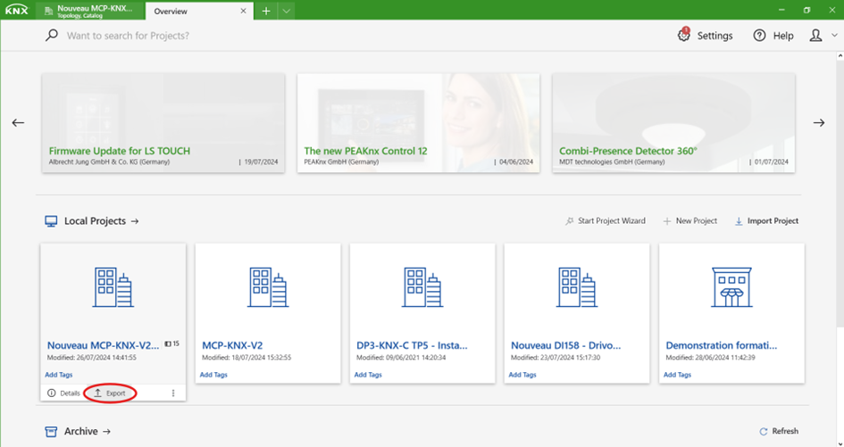
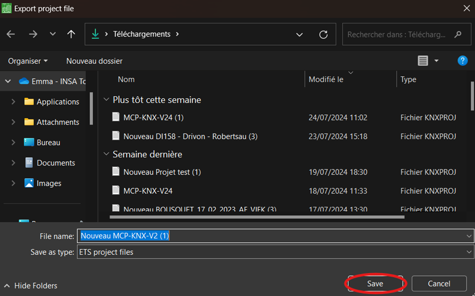

## 3.1. 📁️ Retrieve the Project in ETS 6

For KNX Boost Desktop to work correctly with an imported project, it is essential that the project is not password-protected. If your project is password-protected, follow these steps to remove it:

### Removing the Password

1. **Access Project Details**

- On the home page, hover over the relevant project. The **Details** and **Export** buttons will appear. Click on the **Details** button.

- If the project is already open, click the i button in the top right corner of the window.

2. **Change the Password**

- Once the window is open, click the **Details** button located at the top center of the window.

- Then click on **Change Password**.

- Finally, click on **Clear Password** to remove the password protection.

3. **Managing KNX Secure Participants**

- If you are using one or more KNX Secure participants, a notification will appear indicating that the security of the participants will be disabled. You can re-enable security once the project is exported.

### Exporting the Project

1. **Return to Overview**

- Return to the overview window.

- Hover over the project you wish to export. The **Details** and **Export** buttons will appear. Click on the **Export** button.

2. **Save the Project**

- Choose the destination folder and file name.

- Click **Save** to finalize the project export.

[← Go back](../README-EN.md)
